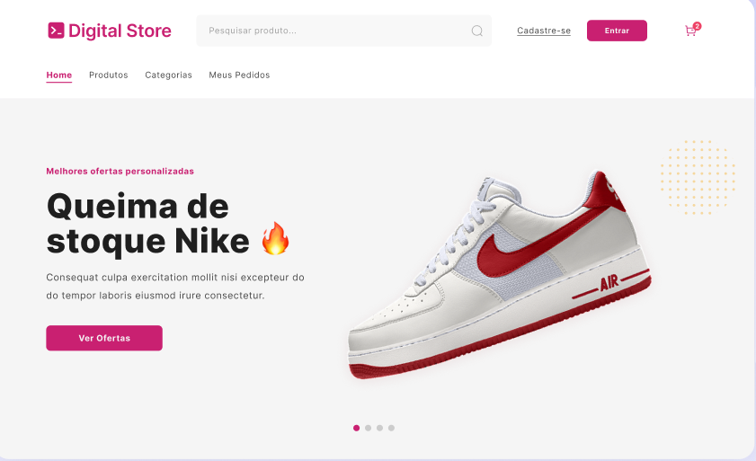

<h1 align="center"> Digital store </h1>

  Este projeto ele foi realizado pelo projeto Geração Tech com o intuido de ser funcional e responsivo

  <a href="#-tecnologias">Tecnologias</a>&nbsp;&nbsp;&nbsp;|&nbsp;&nbsp;&nbsp;
  <a href="#-projeto">Projeto</a>&nbsp;&nbsp;&nbsp;|&nbsp;&nbsp;&nbsp;
  <a href="#-layout">Layout</a>&nbsp;&nbsp;&nbsp;|&nbsp;&nbsp;&nbsp;
  <a href="#participantes">Licença</a>

  

 

  

## 🚀 Tecnologias

Esse projeto foi desenvolvido com as seguintes tecnologias:

- HTML e CSS
- JavaScript
- Git e Github
- Figma
- React/Vite
- Tailwind 

## 💻 Projeto
  
 Este projeto é uma plataforma de e-commerce com a experiência de um usuário utilizando-o. É um site responsivo compatível com todos os dispositivos.

## 🔖 Layout

Você pode visualizar o layout do projeto através [DESSE LINK](https://www.figma.com/design/cfb4F7ZXMFQmvmTn3PKI4z/DRIP-STORE---DIGITAL-COLLEGE?node-id=309-738). É necessário ter conta no [Figma](https://figma.com) para acessá-lo.

## Participantes 

- Ezequias de Oliveira Bernardo [github](https://github.com/Ez3qu14s) [Linkedin](https://www.linkedin.com/in/ezequias-de-oliveira-bernardo-2b216420b?utm_source=share&utm_campaign=share_via&utm_content=profile&utm_medium=android_app)
- Emmanuel Cordeiro Monte [github](https://github.com/manuzx) [Linkedin](https://www.linkedin.com/in/emmanuel-cordeiro-653a132a7?utm_source=share&utm_campaign=share_via&utm_content=profile&utm_medium=android_app)
- Cláudia Ysla de Sousa Martins [github](https://github.com/yslamartins) [Linkedin](https://www.linkedin.com/in/ysla-martins-dev)
- Daniel Santos de Araújo [github](https://github.com/DanielSantosAraujo) [Linkedin](https://www.linkedin.com/in/daniel-santos-developer/)
- Agleice Faria de Sousa [github](https://github.com/agleicesousa) [Linkedin](https://www.linkedin.com/in/agleice-faria-de-sousa-47a6722a2/)
 